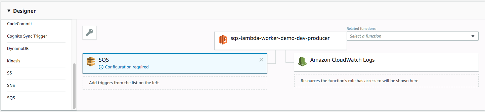

# sqs-lambda-worker-demo

> Test drive sqs integration with aws lambda

## TODO

add event trigger for lambda worker fn
change iam role to add sqs service

This demo repo uses boilerplate project at [Serverless Node.js Starter](https://github.com/shavo007/serverless-nodejs-starter)

## Install

-   Node

-   Yarn

1.  `curl -o- -L https://yarnpkg.com/install.sh | bash`
2.  `yarn bash completion` - https://github.com/dsifford/yarn-completion

-   Terraform

```bash
# If you don't already have the serverless cli installed, do that
yarn global add serverless

# Install dependencies
yarn
```

### Terraform (create sqs queue)

1.  Create sqs queue on aws account
2.  cd terraform && terraform init
3.  terraform plan
4.  terraform apply

### Deploy

1.  Create sqs queue via terraform above
2.  Update the sqs queue url in src/producer.js file

3.

Assuming you've already set up your default AWS credentials

`yarn deploy:dev` will deploy to "dev" environment.

Right now there is a PR open for serverless fwk. So you can for now manually add event source for fn producer and change IAM role permissions to have access to sqs service.



## Run

trigger the producer fn
verify the consumption in the logs

### Renovate

> Automated Dependency Updates

Renovate runs continuously to detect the latest available versions. And automagicaly creates PR on your github project with changelog and release notes.

For more info and how to authorise the github app check out [onboarding guide](https://renovateapp.com/docs/getting-started/configure-renovate)

## Resources

https://aws.amazon.com/blogs/aws/aws-lambda-adds-amazon-simple-queue-service-to-supported-event-sources/
